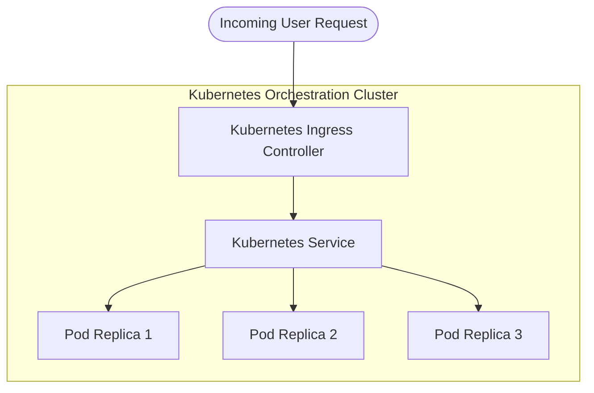
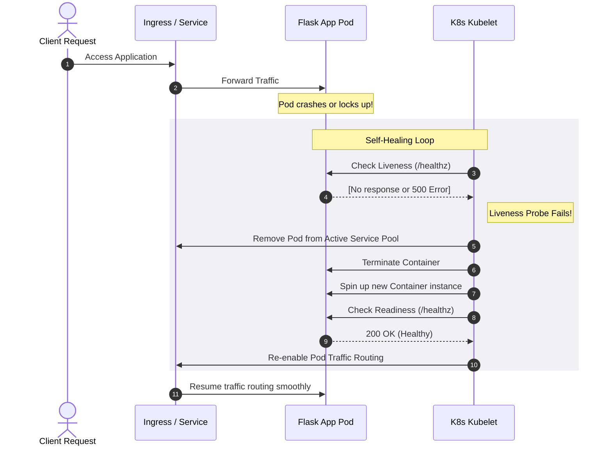

# ☸️ Kubernetes & Enterprise Self-Healing Infrastructure Guide

Welcome to the comprehensive architecture and operational guide for the **Enterprise-Grade Self-Healing DevSecOps Pipeline**. This document provides an in-depth explanation of Kubernetes orchestration, standard container infrastructure concepts, and how they are leveraged in this repository to achieve automatic healing, dynamic scaling, and continuous telemetry monitoring.

---

## 🏗️ 1. Understanding Kubernetes (K8s)

**Kubernetes** (often abbreviated as **K8s**, representing the 8 letters between 'K' and 's') is an open-source container orchestration system designed by Google and now maintained by the Cloud Native Computing Foundation (CNCF). It automates the deployment, scaling, management, and networking of containerized applications.

### Why Do We Need K8s?
In modern cloud-native architectures, applications are broken down into small, independent microservices packaged in containers (e.g., Docker). Managing thousands of containers manually across virtual and physical servers is virtually impossible. Kubernetes provides a declarative framework to run distributed systems resiliently, taking care of scaling, failovers, deployment patterns, and more.



---

## 🧩 2. Core Kubernetes Abstractions & Concepts

Kubernetes manages infrastructure using a set of highly decoupled API resources. Below are the core resources used in our pipeline:

### A. Pods: The Unit of Execution
*   **Definition**: A **Pod** is the smallest, most basic deployable unit in Kubernetes. It represents a single instance of a running process in your cluster.
*   **Multi-Container Pods**: A Pod can host a single container, or multiple tightly-coupled containers that share resources (storage, network, and IP space). For example, our Flask application runs as the main container inside its Pod, while sidecar containers can be attached to stream logs or proxy traffic.

### B. Deployments: Declarative Scaling & Rollouts
*   **Definition**: A **Deployment** provides declarative updates for Pods and ReplicaSets. You describe a desired state in a YAML manifest (e.g., "I want 3 replicas of the Flask container image v1.2.0"), and the Deployment Controller changes the actual state to the desired state at a controlled rate.
*   **Zero-Downtime Rollouts**: It supports rolling updates, ensuring new versions of containers are spun up and verified before the old ones are terminated.

### C. Services: Stable Networking & Load Balancing
*   **Definition**: Since Pods are ephemeral (they can be destroyed and recreated with new IP addresses at any time), a **Service** acts as an abstraction layer. It defines a logical set of Pods and a policy to access them.
*   **Load Balancing**: It exposes a stable virtual IP address and DNS name (e.g., `flask-app-healing`), load balancing incoming traffic across all healthy pod replicas matching its selector.

### D. Ingress & Ingress Controllers: Application Layer Routing
*   **Definition**: An **Ingress** manages external access to the services in a cluster, typically HTTP/HTTPS.
*   **Ingress Controller**: The actual load balancer (like NGINX Ingress Controller) that implements the Ingress rules. It routes traffic based on the URL path or host header (e.g., sending `http://flask-app.local/` directly to our backend Service).

### E. Horizontal Pod Autoscaler (HPA): Elasticity
*   **Definition**: The **HPA** automatically scales the number of Pods in a replication controller, deployment, or replica set based on observed CPU utilization or custom metrics.
*   **Mechanic**: If CPU utilization spikes above a configured threshold (e.g., 80%), the HPA commands the deployment to scale up from 2 to up to 5 replicas. Once the load subsides, it slowly scales the replicas back down to avoid wasting resources.

---

## 🛡️ 3. The Self-Healing Infrastructure Architecture

This repository showcases a resilient **Self-Healing Infrastructure** designed to handle runtime anomalies, performance degradation, and pipeline failures automatically.



### 1. Auto-Healing Mechanics (Probes)
We leverage Kubernetes-native **Liveness** and **Readiness** probes configured in the [deployment.yaml](file:///e:/devProject/self-healing-devops-pipeline/helm/flask-app-healing/templates/deployment.yaml) template to monitor and recover container instances:

*   **Liveness Probe**: 
    *   *Purpose*: Determines if a container needs to be restarted.
    *   *Behavior*: If our Flask app experiences a fatal deadlock or runs into an unrecoverable state, the `/healthz` endpoint stops returning a `200 OK`. The Kubelet detects this failure, kills the faulty container, and provisions a brand-new container instance.
*   **Readiness Probe**: 
    *   *Purpose*: Determines if a container is ready to accept client traffic.
    *   *Behavior*: If our app is experiencing temporary database latency or heavy load, it should not receive requests. The readiness probe fails, prompting Kubernetes to temporarily remove that specific Pod's IP from the active load-balancing pool. Once the pod stabilizes, it is re-inserted into the pool without downtime.

### 2. Auto-Scaling Mechanics (HPA)
The deployment is accompanied by an **HPA** ([hpa.yaml](file:///e:/devProject/self-healing-devops-pipeline/helm/flask-app-healing/templates/hpa.yaml)) which works as follows:
*   **Metrics Server**: Collects resource metrics (`kubectl top pods`) from Kubelet.
*   **Threshold**: Set at **80% CPU usage**.
*   **Scaling Policy**: Scales replicas dynamically between `2` (minimum) and `5` (maximum). This ensures that traffic spikes are absorbed by distributing the load across multiple instances.

### 3. Continuous Integration & Auto-Rollback (Jenkins & Helm)
The pipeline is orchestrated via [Jenkinsfile](file:///e:/devProject/self-healing-devops-pipeline/Jenkinsfile), which acts as our DevSecOps conductor:
1.  **DevSecOps Scans**: Runs static security audits on the Python codebase (`Bandit`), Python packages (`Safety`), and built docker images (`Trivy`).
2.  **Continuous Deployment**: Deploys the package using a Helm chart (`helm upgrade --install`).
3.  **Auto-Rollback**: If the verification stage detects a failure post-deployment (e.g., the application is crashing, failing probes, or triggering anomalous metrics), Jenkins automatically triggers `helm rollback` to restore the last stable release.

---

## 📊 4. Telemetry & Monitoring Infrastructure

Monitoring a Kubernetes cluster requires a robust telemetry stack to collect and visualize metrics, logs, and events in real-time. This project configures a complete cloud-native observability stack inside [kubernetes/monitoring/](file:///e:/devProject/self-healing-devops-pipeline/kubernetes/monitoring):

```
                  ┌───────────────┐
                  │   K8s Pods    │───(Logs)────► [ Promtail ]
                  └───────────────┘                   │
                          │                           ▼
                     (Metrics)                  [ Grafana Loki ]
                          │                           │
                          ▼                           ▼
                  [ Prometheus ] ──────────────► [ Grafana ] ◄── (Visual Dashboards)
```

1.  **Prometheus**: Acts as the time-series database. It is configured to automatically discover Kubernetes services and scrape container metrics (like CPU usage, memory foot-print, and custom business metrics).
2.  **Grafana**: Provides a gorgeous, customizable dashboard interface for monitoring cluster resources. It queries Prometheus to draw charts of CPU load, memory footprints, and pod restart occurrences.
3.  **Grafana Loki & Promtail**:
    *   **Promtail** runs as a `DaemonSet` on every node, capturing raw logs directly from stdout and stderr of all active pods.
    *   It streams these logs to **Loki** (a highly scalable log aggregation system), allowing centralized log inspection inside Grafana with query syntax (LogQL).

---

## 📈 5. Production Infrastructure Best Practices

When moving from a local sandbox (like Minikube) to production-grade Kubernetes, these essential guidelines should be followed:

1.  **Define Strict Resource Requests & Limits**:
    *   Always configure `resources.requests` (the guaranteed resources a pod needs to schedule) and `resources.limits` (the maximum resources a pod is allowed to consume). This prevents a single compromised or runaway pod from hogging the entire cluster node.
2.  **Use Pod Disruption Budgets (PDBs)**:
    *   A PDB limits the number of pods of a replicated application that are down simultaneously due to voluntary disruptions (e.g., node upgrades).
3.  **Implement Network Policies**:
    *   By default, all pods in a Kubernetes cluster can communicate with each other. Use `NetworkPolicies` to enforce firewalls between namespaces and restrict traffic (e.g., only allowing the backend Flask app pod to talk to the database pod).
4.  **Configure Multi-Availability Zone Deployments**:
    *   Use pod anti-affinity rules to ensure that pod replicas are scheduled across different nodes and different hardware zones, ensuring high availability even during a physical data center outage.
